こんにちはkakkun61こと岡本和樹です。

去る11月10日にHaskell Day 2018が開催されましたので、そのイベントレポートをお送りします。

# Haskell Day 2018とは

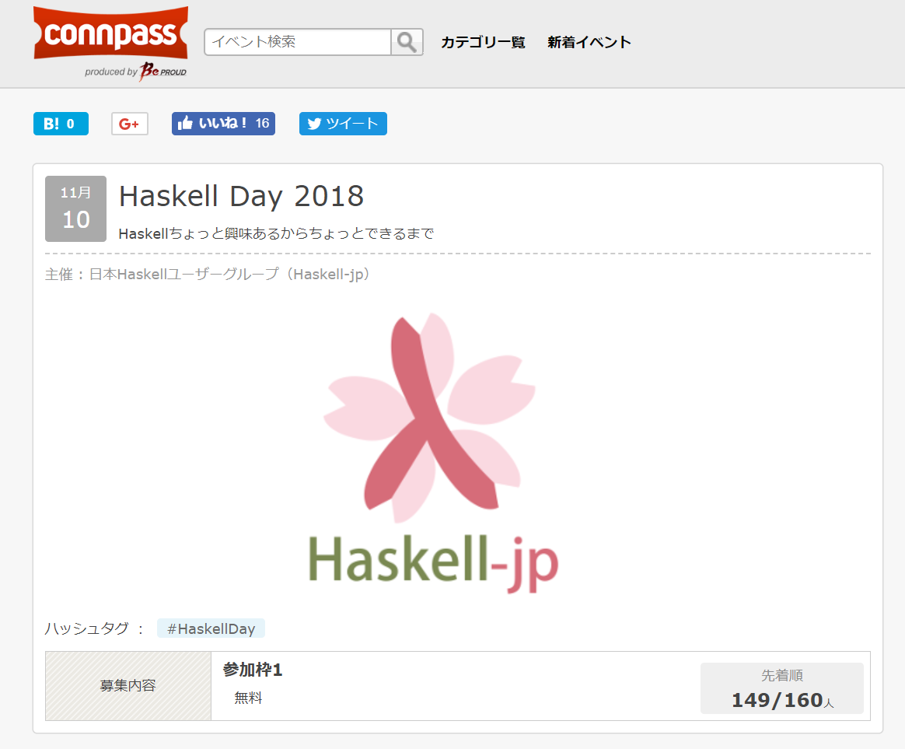

[https://haskell-jp.connpass.com/event/92617/](https://haskell-jp.connpass.com/event/92617/)

Haskell Dayは2012年2016年と不定期に開催しており今回で3度目となります。

2018年の今回は「Haskellちょっと興味あるからちょっとできるまで」というサブタイトルで開催されました。

# セッション

## 「作りながら学ぶHaskell入門」を使ったハンズオン

開発中の対話的チュートリアル[「作りながら学ぶHaskell入門」](https://github.com/haskell-jp/makeMistakesToLearnHaskell)を使って、参加者の皆さんにもくもくと入門していただきました。「作りながら学ぶHaskell入門」では、簡単な課題を解くことで、Haskellの初歩的な使い方を学びつつ、学んだ知識をその場でテストできます。

[https://github.com/haskell-jp/makeMistakesToLearnHaskell](https://github.com/haskell-jp/makeMistakesToLearnHaskell)

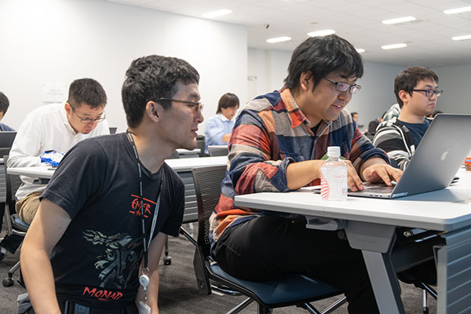

----

## Haskellを導入した話とHRRの紹介

[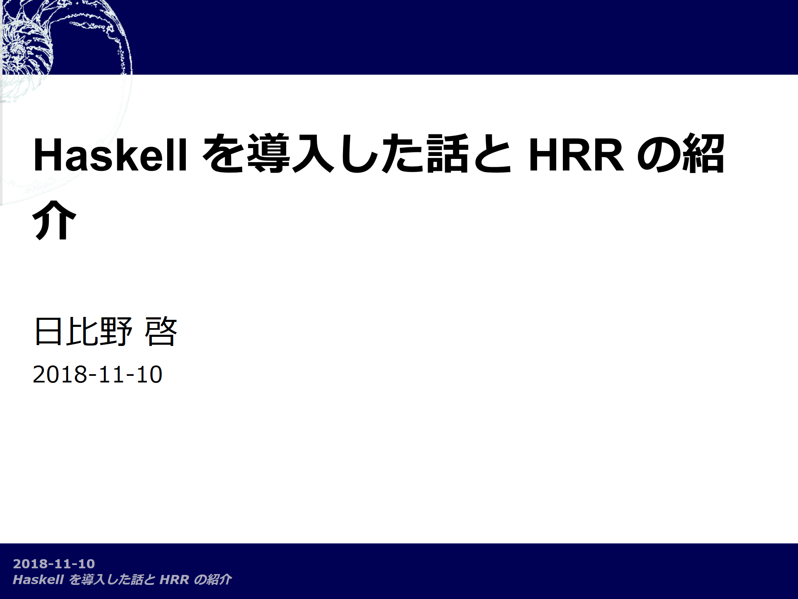](https://htmlpreview.github.io/?https://github.com/khibino/haskell-day-2018/blob/master/presentation.html)

----

## Servantで実現する高速かつ安全なAPI開発

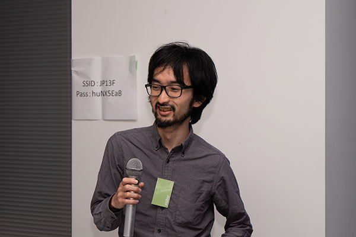

----

## 並列並行言語Haskell

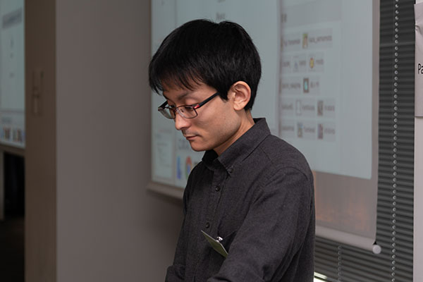

----

## Dhall: Haskellの新たなキラーアプリ

----

## Semigroupとは？Monoid？環？

[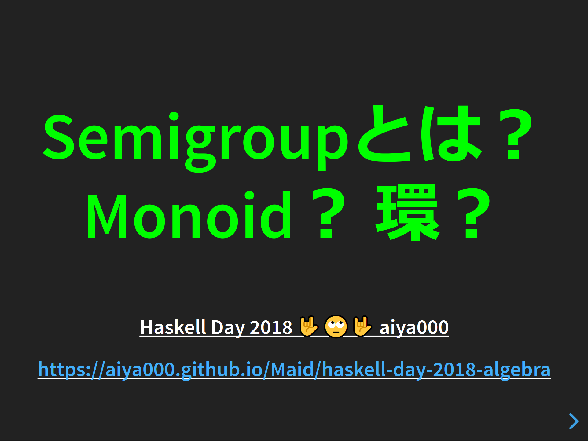](https://aiya000.github.io/Maid/haskell-day-2018-algebra/#/)

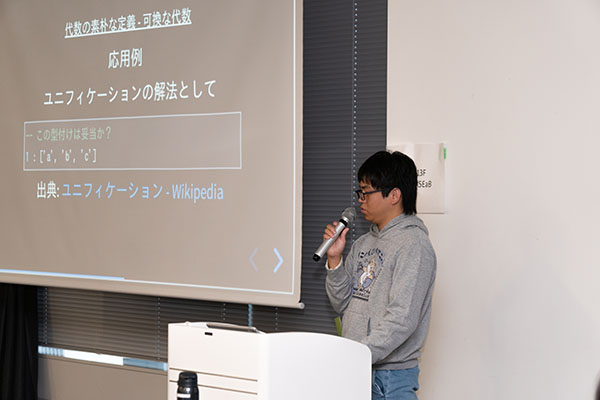

----

## HaskellでCLI

<iframe src="//www.slideshare.net/slideshow/embed_code/key/FQE1QxbCST8kYi" width="595" height="485" frameborder="0" marginwidth="0" marginheight="0" scrolling="no" style="border:1px solid #CCC; border-width:1px; margin-bottom:5px; max-width: 100%;" allowfullscreen> </iframe> 
 <strong> <a href="//www.slideshare.net/noob00/haskell-cli" title="Haskell で CLI" target="_blank">Haskell で CLI</a> </strong> from <strong><a href="https://www.slideshare.net/noob00" target="_blank">Nobutada Matsubara</a></strong> 

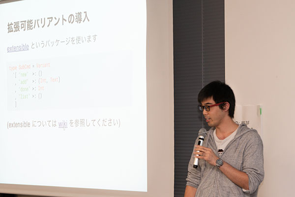

----

## gloss: 動かして遊んで学ぶHaskell

[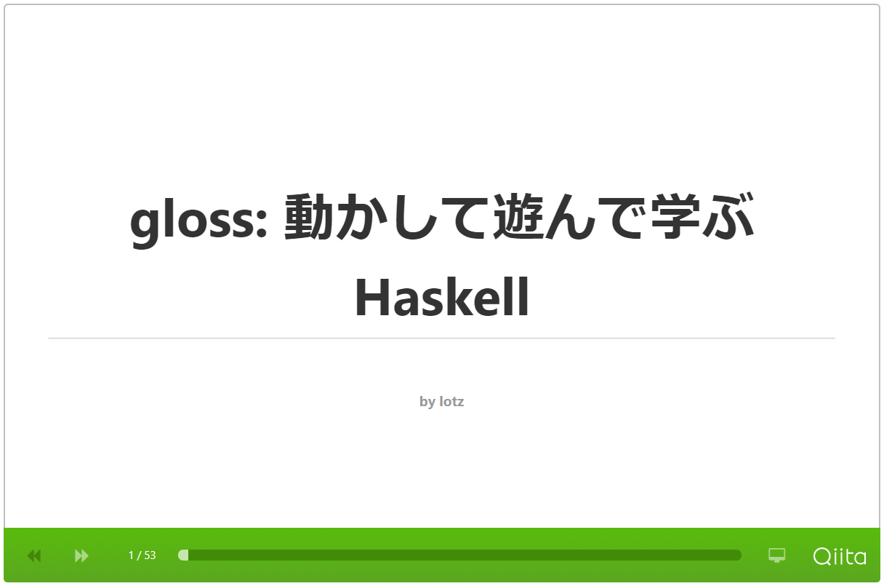](https://qiita.com/lotz/items/bdb04c771efc8919b79c)

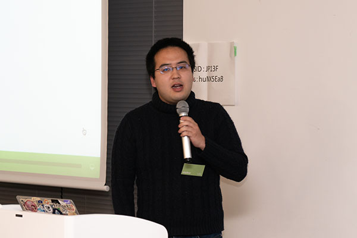

----

## Lisztあるいは永続データ構造を真に永続させる方法

## 懇親会

スポンサーとしてIIJに飲食物の提供をしていただきました。

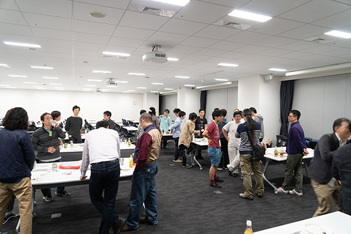

# アンケート

約110名の方が出席し約40名の方が回答してくださいました。

参加できなくなった約40名の方は事前のキャンセルをよろしくお願いします。

## Haskellを始めてどれくらい経ちますか？

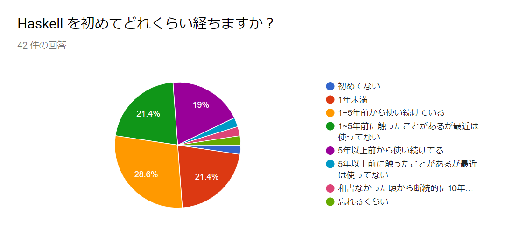

ここ1年以内に始めた方が全体の21.4％、1年以上5年未満前に始めた方がちょうど半分程度となりました。1年以上5年未満前に始めた方の57%の方は今でもHaskellを使い続けているようです。

5年以上前に始めた方は全体の1/4となりました。

## 読んだことのある日本語のHaskell本は？

項目は下記となります。

- すごい Haskell たのしく学ぼう！
- プログラミング Haskell
- Haskell による並列・並行プログラミング
- 関数プログラミング実践入門 ── 完結で正しいコードを書くために
- 関数プログラミング入門 ── Haskell で学ぶ原理と技法
- Real World Haskell
- 関数プログラミング ── 珠玉のアルゴリズムデザイン
- 簡約！λカ娘
- Haskell ── 教養としての関数型プログラミング
- その他（自由記述）

この項目にはアンケートの途中で追加したものもあるので、結果があまり厳密でないことに注意してください。

その他の選択肢で自由記述では次の票がありました。

- Haskell入門 10票
- ふつうのHaskell 1票
- Haskellによる関数プログラミングの思考法 1票

# 終わりに

参加者の発表者、スタッフのみなさんのおかげで無事開催することができました。ありがとうございました。

今後ともHaskell-jpをよろしくお願いします。
