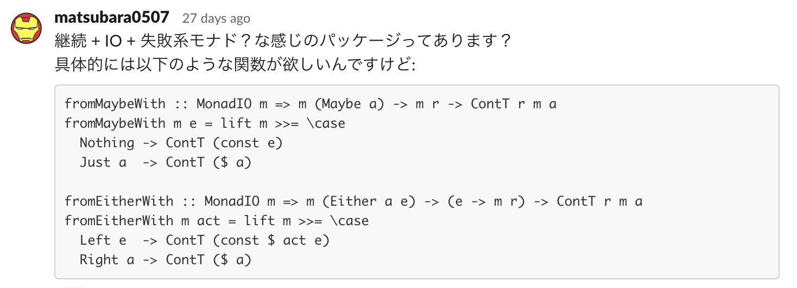

タイトルの通り、fallibleというパッケージを紹介します。

- [matsubara0507/fallible: interface for fallible data type like Maybe and Either. - GitHub](https://github.com/matsubara0507/fallible)

ちなみに、fallibleはHaskell-jp Slackで:



と質問したところ、該当するようなパッケージは無さそうだったので作ったという経緯があります。
その際に助言をくれた [fumieval](https://github.com/fumieval)氏のコードをほとんど引用した形になったので、Haskell-jp Blogに紹介記事を載せることにしました(僕は普段、自分のブログに自作したパッケージを書いています)。

## fallibleパッケージ

Haskellでアプリケーションを記述してると次のようなコードを書くことがありますよね？

```Haskell
import qualified Data.List as L

run :: String -> Token -> Bool -> IO ()
run targetName token verbose = do
  users <- getUsers token
  case users of
    Left err -> logDebug' err
    Right us -> do
      case userId <$> L.find isTarget us of
        Nothing  -> logDebug' emsg
        Just tid -> do
          channels <- getChannels token
          case channels of
            Left err  -> logDebug' err
            Right chs -> do
              let chs' = filter (elem tid . channelMembers) chs
              mapM_ (logDebug' . channelName) chs'
  where
    logDebug' = logDebug verbose
    emsg = "user not found: " ++ targetName
    isTarget user = userName user == targetName

logDebug :: Bool -> String -> IO ()
logDebug verbose msg = if verbose then putStrLn msg else pure ()
```

Slackのようなチャットツールをイメージしてください。
該当の名前(`targetName`)を持つユーザーを与えると、そのユーザーが参加しているチャンネルの一覧を表示するというような振る舞いです。
こう段々になってしまうのは気持ち悪いですよね。
fallibleの目的はこの段々を次のように平坦にすることです(`where` などは割愛):

```Haskell
import Data.Fallible (evalContT, exit, lift, (!?=), (???))

run :: String -> Token -> Bool -> IO ()
run targetName token verbose = evalContT $ do
  users    <- lift (getUsers token) !?= exit . logDebug'
  targetId <- userId <$> L.find isTarget users ??? exit (logDebug' emsg)
  channels <- lift (getChannels token) !?= exit . logDebug'
  lift $ mapM_ (logDebug' . channelName) $
    filter (elem targetId . channelMembers) channels
```

### やってること

というか、もともとのアイデアは下記のブログです:

- [ContT を使ってコードを綺麗にしよう！ - BIGMOON Haskeller's BLOG](https://haskell.e-bigmoon.com/posts/2018/06-26-cont-param.html)

これを一般化(`Maybe a` 固有ではなく `Either e a` でも使う)できないかなぁというのがもともとの発想です。

### 基本演算子

次の4つの演算子を利用します:

```Haskell
(!?=) :: Monad m => m (Either e a) -> (e -> m a) -> m a
(!??) :: Monad m => m (Maybe a) -> m a -> m a
(??=) :: Applicative f => Either e a -> (e -> f a) -> f a
(???) :: Applicative f => Maybe a -> f a -> f a
```

ただし、内部実装的には `Maybe a` や `Either e a` は `Fallible` 型クラスで一般化されています:

```Haskell
class Applicative f => Fallible f where
  type Failure f :: *
  tryFallible :: f a -> Either (Failure f) a

instance Fallible Maybe where
  type Failure Maybe = ()
  tryFallible = maybe (Left ()) Right

instance Fallible (Either e) where
  type Failure (Either e) = e
  tryFallible = id

(!?=) :: (Monad m, Fallible t) => m (t a) -> (Failure t -> m a) -> m a
(???) :: (Applicative f, Fallible t) => t a -> f a -> f a
```

これらを継続モナドと組み合わせることでIOと失敗系モナド(`Maybe a` や `Either e a`)を、モナドトランスフォーマーなしにDo記法で書くことができます！

```Haskell
-- 継続モナドに関する関数
evalConstT :: Monad m => ContT r m r -> m r

exit :: m r -> ContT r m a
exit = ContT . const
```

## サンプルコード

疑似的なIOで良いなら[fallibleリポジトリのexampleディレクトリ](https://github.com/matsubara0507/fallible/tree/master/example)にあります(上述の例はそれです)。

実際の利用例であれば、最近自作した[matsubara0507/mixlogue](https://github.com/matsubara0507/mixlogue)というHaskellアプリケーションで多用しています([ココ](https://github.com/matsubara0507/mixlogue/blob/8afd16ab4048ff62976b8e38347078fdaa7417dd/src/Mixlogue/Cmd.hs#L81-L93)とか[ココ](https://github.com/matsubara0507/mixlogue/blob/8afd16ab4048ff62976b8e38347078fdaa7417dd/src/Mixlogue/Message.hs#L15-L25)とか)。
ちなみに、mixlogueは特定のSlackの分報チャンネル(`times_hoge`)の発言を収集するというだけのツールです。

## 使い方

READMEを参照してください。

現状Hackageにはあげてないので、stackやCabalでGitHubリポジトリから参照する方法を利用してください。

## おしまい

fumieval氏のコードをほとんど引用するだけになったので自分でリリースするか迷ったんですけど、リリースしてくれというのも丸投げがひどいので自分でリリースしました。
まぁこういう結果が生まれるのもOSSコミュニティの醍醐味ということで。
fumieval氏、いつもアドバイスをくれてありがとう！

(もちろん他のHaskell-jpの皆さんも！)
