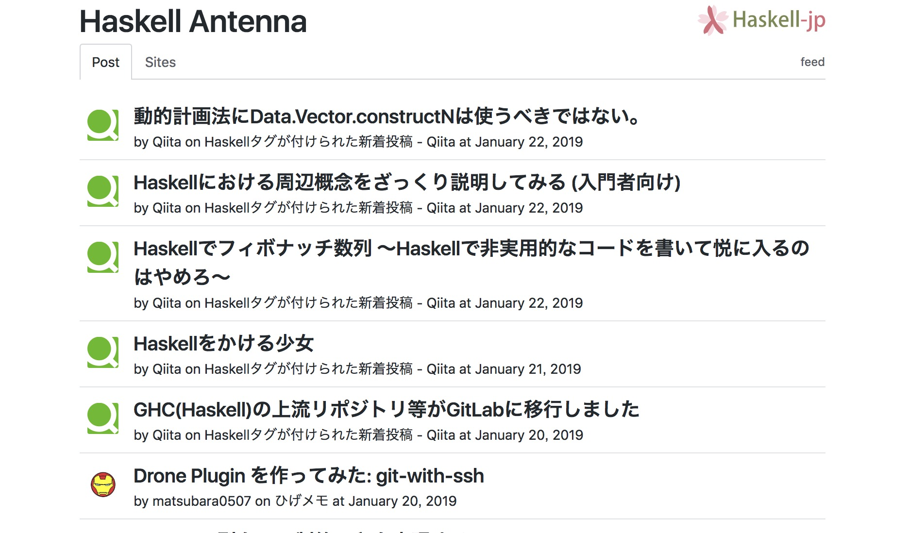
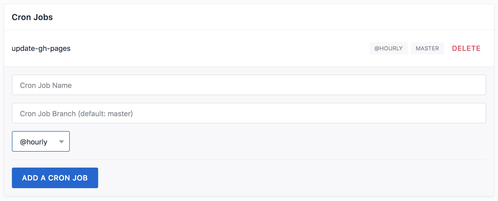

Haskell-jpのコンテンツの一つとして[Haskell Antenna](https://haskell.jp/antenna/)という Web ページの開発・運用をしております。



このWebページは[Haskell-jpのリポジトリ](https://github.com/haskell-jp/antenna)で開発し、GitHub Pagesとして公開しています。
更新は[TravisCI](https://travis-ci.org/)のDaily Cronを使って行なっていましたが、なんとかして **毎時更新を実現したい** と思案していました。
ひょんなことから[Drone Cloud](https://cloud.drone.io/)というCIサービスを見つけ、このサービスではHourly Cronが可能だったので試しに更新の部分だけ移行してみました。
という話です。

ちなみに、本稿は全くHaskellのコードが出て来ません ;)

# Drone.io

Drone Cloudはパブリックリポジトリであれば無料で利用できるCIサービスです。
内部では[Drone](https://drone.io/)というOSSのCIプラットフォームを利用しています。
Droneは以下のような特徴を持っています:

- JenkinsのようなOSSである(Go言語製)
- TravisCIやCircleCIのようなパイプラインによる設定を行う(YAML形式)
- Dockerとの親和性が高くk8sなどでの動作もサポートしている
- Pluginシステムによって外部サービスとの連携が可能

OSSのためお好みのクラウドサービスなどで自前運用も可能ですし、Drone Enterpriseという有料のクラウドサービスも提供しています。

# 毎時更新を実現するために

単純にDroneの設定ファイルを記述するだけではなく、次のような作業を行いました:

- Haskell AntennaのDockerイメージ化
- AntennaのDockerイメージを自動更新
- Drone Cloudの設定
- Personal TokenからDeploy Keyに移行
- Slackの通知回りを整理

順に説明していきましょう。

## AntennaのDockerイメージ化

Drone Cloudでは無償でキャッシュを利用することができません[^drone-cache]。
Haskell(というかStack)のCIをしている方ならわかると思いますが、キャッシュなしにビルドするとすごい時間がかかります。
なので、Haskell Antennaの静的ページの生成を行う `antenna` コマンドをDockerイメージとしておき、Drone内ではこのイメージを利用して静的ページの生成を行う方針でいきます。

[^drone-cache]: キャッシュの導入の仕方は記事にしたので興味のある方は是非「[GCS で Drone 1.0 をキャッシュする - ひげメモ](https://matsubara0507.github.io/posts/2019-01-06-use-drone-cache-with-gcs.html)」

もちろんDockerイメージの生成には、StackのDockerインテグレーションを使います。
以下のような設定をstack.yamlに追記し:

```yaml
# stack.yaml
docker:
  repo: fpco/stack-build
  enable: false
image:
  container:
    name: antenna
    base: fpco/ubuntu-with-libgmp
```

次のようなコマンドを実行するだけで`antenna`というDockerイメージが生成されます:

```
stack docker pull
stack --docker image container
```

Docker Hubに[`haskelljp/antenna`](https://hub.docker.com/r/haskelljp/antenna/)というネームスペースを確保した[^haskelljp-dockerhub]のでここにプッシュしました:

[^haskelljp-dockerhub]: もしDocker Hubのhaskelljp組織アカウントのメンバーになりたい場合はHaskell-jp Slackで声をかけてください(チャンネルはどこでも良いですよ)。

```
docker tag antenna haskelljp/antenna
docker push haskelljp/antenna
```

ちなみに、`haskell-jp` ではなく `haskelljp` なのは、Docker Hubの組織アカウント名には `-` が使えなかったからです。

## Dockerイメージの自動更新

Docker HubにはAutomated buildsと呼ばれるGitHubなどのプッシュによって行う自動ビルドがありますが、StackのDocker Integrationを使うと、その機能を利用することができません。
そこで、TravisCIを使って自動ビルドすることにしました。
この辺りは「[Stack の Docker Integration とイメージの自動更新 - ひげメモ](https://matsubara0507.github.io/posts/2018-12-02-stack-docker-travici.html)」で記事にしてあるので、細かい話は割愛します。

今回は次のような設定をして、master ブランチにプッシュがあった時にのみDocker Hubにプッシュします:

```yaml
# .travis.yml

# ...

install:
- mkdir -p ~/.local/bin
- export PATH=$HOME/.local/bin:$PATH
- travis_retry curl -L https://www.stackage.org/stack/linux-x86_64 | tar xz --wildcards --strip-components=1 -C ~/.local/bin '*/stack'
- stack docker pull
jobs:
  include:
    - stage: build dependencies
      script: stack --no-terminal --docker --install-ghc test --bench --only-dependencies
    - stage: build antenna
      script: stack --no-terminal --docker build --bench --no-run-benchmarks --no-haddock-deps --pedantic
    - stage: push docker image
      if: branch = master AND type = push
      script:
      - stack --docker image container
      - docker tag antenna haskelljp/antenna
      - echo "$DOCKER_PASSWORD" | docker login -u "$DOCKER_USERNAME" --password-stdin
      - docker push haskelljp/antenna
```

DockerでHaskellのビルドもするために毎回Docker Pullが走るようになり少し遅くなったのが辛いですね(今後要検討)。

## Drone Cloudの設定

いよいよDroneによる `antenna` コマンドの実行を設定します。
元々は TravisCI でこんな感じでした:

```yaml
jobs:
  include:
    - stage: install anttena
      script: stack --no-terminal install
    - stage: exec antenna
      script: git clone -b gh-pages "https://${GH_TOKEN}@github.com/${TRAVIS_REPO_SLUG}.git" temp
      if: branch = master AND type IN (push, cron)
      after_success:
        - cp sites.yaml temp/sites.yaml
        - cp -r image/* temp/image
        - cd temp
        - stack exec -- antenna sites.yaml
        - git config user.name "${GIT_NAME}"
        - git status
        - git add -A
        - git diff --quiet && git diff --staged --quiet || git commit -am "[skip ci] Update planet haskell. See https://haskell.jp/antenna/ for new entries!"
        - git push origin gh-pages
```

`stack install` で `antenna` コマンドの実行ファイルを生成し(これはキャッシュされるので早い)、`gh-pages` ブランチへページの更新をプッシュするためにGitHubのPersonal Tokenを使って再度クローンしていました。
更新の有無は `git diff` を使って確認しています。

まずはこれをこのままDroneに移植します:

```yaml
# .drone.yml

kind: pipeline
name: default

steps:
- name: exec antenna
  image: matsubara0507/antenna
  environment:
    GH_TOKEN:
      from_secret: github_api_token
    GIT_NAME: BOT
  commands:
  - git clone -b gh-pages "https://${GH_TOKEN}@github.com/haskell-jp/antenna.git" temp
  - cp sites.yaml temp/sites.yaml
  - cp -r image/* temp/image
  - cd temp
  - antenna sites.yaml
  - git config user.name "${GIT_NAME}"
  - git status
  - git add -A
  - git diff --quiet && git diff --staged --quiet || git commit -am "[skip ci] Update planet haskell. See https://haskell.jp/antenna/ for new entries!"
  - git push origin gh-pages
  when:
    branch:
    - master
    event:
      exclude:
      - pull_request
```

記法は違うもののそのまま移植ができました。
条件(`if`や`when`)のところですが、Droneで`cron`のイベントを指定する方法がわからなかったので、動作しては困る`pull_request`だけ弾くようにしました。

Cronの設定はWeb UI上で行います:



これで毎時間`master`ブランチのビルドが実行されます。

## Personal TokenからDeploy Keyに移行

Personal Tokenは他の個人のリポジトリも操作できてしまうので、兼ねてからできれば使いたくないなと思っていました(特に個人プロジェクトじゃないHaskell-jpのプロジェクトでは)。
なので、これを機にリポジトリ固有のDeploy Keyに移行しました。

CircleCIのような書き込み用のSSH Keyを登録する機能はDroneにはありません。
代わりに次のように書くと良いです:

```yaml
steps:
- name: clone gh-pages
  image: docker:git
  environment:
    SSH_KEY:
      from_secret: deploy_key
  commands:
  - mkdir /root/.ssh && echo "$SSH_KEY" > /root/.ssh/id_rsa && chmod 0600 /root/.ssh/id_rsa
  - echo -e "Host github.com\n\tStrictHostKeyChecking no\n" > /root/.ssh/config
  - git clone -b gh-pages git@github.com:haskell-jp/antenna.git temp
```

SecretというのはDrone側で保持・秘匿できる環境変数のような機能です(名前が違うだけでだいたいどのCIプラットフォームにもありますね)。
今回はせっかくなので、これをDrone Pluginとして自作した[^git-with-ssh]、[`matsubara0507/git-with-ssh`](https://github.com/matsubara0507/drone-git-with-ssh) というのを使います:

[^git-with-ssh]: この話も記事にしておきました「[Drone Plugin を作ってみた: git-with-ssh - ひげメモ](https://matsubara0507.github.io/posts/2019-01-20-create-drone-git-with-ssh.html)」

```yaml
# .drone.yml
kind: pipeline
name: default

steps:
- name: clone gh-pages
  image: matsubara0507/git-with-ssh
  settings:
    ssh_private_key:
      from_secret: deploy_key
    ssh_hosts:
    - github.com
    commands:
    - git clone -b gh-pages git@github.com:haskell-jp/antenna.git temp
  when:
    branch:
    - master
    event:
      exclude:
      - pull_request

- name: exec antenna
  image: haskelljp/antenna
  commands:
  - mkdir -p temp
  - cp sites.yaml temp/sites.yaml
  - cp -r image/* temp/image
  - cd temp
  - antenna sites.yaml

- name: push gh-pages
  image: matsubara0507/git-with-ssh
  settings:
    ssh_private_key:
      from_secret: deploy_key
    ssh_hosts:
    - github.com
    commands:
    - cd temp && git config user.name  BOT
    - cd temp && git config user.email bot@example.com
    - cd temp && git status
    - cd temp && git add -A
    - cd temp && git diff --quiet && git diff --staged --quiet || git commit -am "[skip ci] Update planet haskell. See https://haskell.jp/antenna/ for new entries!"
    - cd temp && git push origin gh-pages
  when:
    branch:
    - master
    event:
      exclude:
      - pull_request
```

`cd temp &&` というのがダサいですが、そこはおいおい直します(`git-with-ssh` の方を)。

## Slackの通知回りを整理

元々はHaskell-jpの `#antenna` チャンネルにGitHubの通知設定をしているだけでした。
今回の開発中、ずっとコミットの通知などが来てうるさかったので次のように分けました:

- `#antenna` チャンネルは `gh-pages` ブランチのコミットだけ通知
    - ついでにHaskell AntennaのRSSを設定した
- `#antenna-dev` チャンネルを新しく作りGitHubの全ての更新はこっちに設定
- `#dockerhub` チャンネルもついでに作って `haskelljp` の更新を通知する

最近、Docker Hubの大リニュアールがあって、いつのまにかDocker HubとSlackを連携できるようになっていました。
なので試しに連携して更新の通知が飛ぶようにしてみました:


# 今後やりたいこと

いくつかあります:

- LTSの更新(最新GHCがWindowsでも動作したらかな)
- Feedの改善
    - SlackのRSSでもちゃんと更新が通知されるように
- ないしは更新差分の通知
    - Haskell-jp SlackのAppが満杯なので厳しいかも

あと、QiitaのFeedがコメントや追記などでも更新され、その通知が `#antenna` チャンネルに飛んで来てうるさいので修正したいです[^scrapbook]。

[^scrapbook]: この修正は `haskell-jp/antenna` ではなく、[`matsubara0507/scrapbook`](https://github.com/matsubara0507/scrapbook) からやる必要があります。
