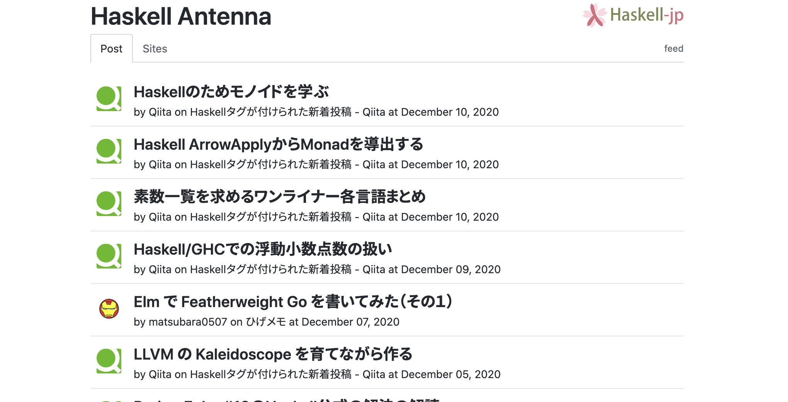
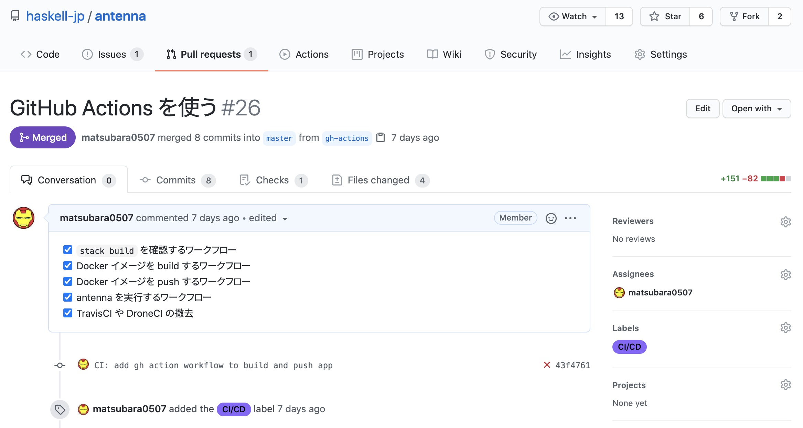
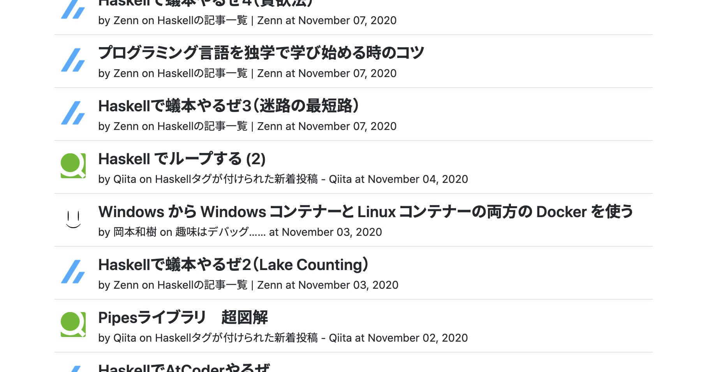

Haskell-jpのコンテンツの一つとして[Haskell Antenna](https://haskell.jp/antenna/)というWebページの開発・運用をしております。



バイナリのビルドやDockerイメージのビルドにTravisCIを、バイナリを実行してページの更新をするのにDroneCIを使っていました。
しかし、長らく放置していてちゃんと動作しているか怪しかったので、メンテナンスをするついでに昨今はやり（要出典）の[GitHub Actionsにこれらを移行することにしました](https://github.com/haskell-jp/antenna/pull/26)。



### Stackプロジェクトのビルド

まずはバイナリのビルドを行うように設定します。
Haskell AntennaのプログラムはHaskell Stackを利用しているので、`stack build`が実行できれば良いです。

```yaml
name: Build Application
on:
  pull_request: null
  push:
    branches:
    - master
jobs:
  build:
    name: ${{ matrix.os }}
    runs-on: ubuntu-18.04
    strategy:
      fail-fast: false
      matrix:
        ghc: ["8.8.4"]
    steps:
    - uses: actions/checkout@v2
    - name: Cache .stack
      id: cache-stack
      uses: actions/cache@v2
      with:
        path: ~/.stack
        key: "\
          ${{ runner.os }}-stack\
          -${{ hashFiles('**/stack.yaml.lock') }}\
          -${{ hashFiles('**/package.yaml') }}\
        "
        restore-keys: |
          ${{ runner.os }}-stack-
    - uses: haskell/actions/setup@main
      name: Setup Haskell
      with:
        ghc-version: ${{ matrix.ghc }}
        enable-stack: true
        stack-version: 'latest'
    - name: Install dependencies
      run: stack --system-ghc test --only-dependencies
    - name: Build and Test
      run: stack --system-ghc test --copy-bins --local-bin-path=./bin
```

これは、PRが作られたときややmasterがプッシュされたときに実行されることを想定しています。

GitHub ActionsでHaskellやHaskell Stackを使うには、~~公式が提供している[actions/setup-haskell](https://github.com/actions/setup-haskell)~~ [haskell/actions/setup](https://github.com/haskell/actions/tree/main/setup) を利用します。
元々はactions/haskell-setupがありましたが、どうやら[メンテナンスする人がいなくなったっぽく](https://github.com/actions/setup-haskell/pull/56)アーカイブされてしまいました。
この記事を書いている時点では移行したばかりでちゃんとタグが切られていないため、mainブランチを指定しています。
ちなみに、StackプロジェクトのGHCバージョンをhaskell/actions/setupでインストールして、`stack --system-ghc`をすることでキャッシュサイズを減らすことができます。

これまた余談ですが、actions/setup-haskellの方を使っていて次のようなエラーが出る場合はactions/setup-haskellのバージョンが古いです（[最新では修正済みです](https://github.com/actions/setup-haskell/issues/44)）。haskell/actions/setupの方を使いましょう。

```bash
Installing ghc version 8.8.4
  Error: Unable to process command '::add-path::/opt/ghc/8.8.4/bin' successfully.
  Error: The `add-path` command is disabled. Please upgrade to using Environment Files or opt into unsecure command execution by setting the `ACTIONS_ALLOW_UNSECURE_COMMANDS` environment variable to `true`. For more information see: https://github.blog/changelog/2020-10-01-github-actions-deprecating-set-env-and-add-path-commands/
```

### Dockerイメージのビルドとプッシュ

[antennaプログラムはDockerイメージにしてDocker Hubに置いてあります](https://hub.docker.com/r/haskelljp/antenna/)（これもGitHub Container Registryに移行したいですね）。
なので、masterの更新に合わせてDockerイメージをビルドしてプッシュするジョブを設定します。
Dockerイメージのビルドとプッシュには[docker/build-push-action](https://github.com/docker/build-push-action)を使います。

```yaml
# さっきと同じ設定ファイルです
name: Build Application
on:
  pull_request: null
  push:
    branches:
    - master
jobs:
  build:
    name: ${{ matrix.os }}
    runs-on: ubuntu-18.04
    strategy:
      fail-fast: false
      matrix:
        ghc: ["8.8.4"]
    steps:
    ... # 割愛
    - name: Build and Test
      run: stack --system-ghc test --copy-bins --local-bin-path=./bin
    # Build and Push Docker Image
    - name: Setup QEMU
      uses: docker/setup-qemu-action@master
      with:
        platforms: all
    - name: Setup Docker Buildx
      id: buildx
      uses: docker/setup-buildx-action@master
      with:
        version: latest
    - name: Login to DockerHub
      uses: docker/login-action@v1
      with:
        username: ${{ secrets.DOCKER_USERNAME }}
        password: ${{ secrets.DOCKERHUB_TOKEN }}
    - name: Build and push
      uses: docker/build-push-action@v2
      with:
        context: .
        builder: ${{ steps.buildx.outputs.name }}
        tags: haskelljp/antenna:latest
        push: ${{ github.event_name != 'pull_request' }}
        build-args: local_bin_path=./bin
```

masterブランチへのプッシュのときにだけDockerイメージのプッシュをして欲しいので、`push:` に `github.event_name != 'pull_request'` を設定しています。
また、Haskell Stackでビルドされたバイナリファイルは`--local-bin-path=./bin`オプションで`./bin`に置いてあります。
これをDockerfileでコピーするようにしている（下記参照）ので、`docker build`の引数に`local_bin_path=./bin`というのを与える必要がありました。

```Dockerfile
FROM matsubara0507/ubuntu-for-haskell:git
ARG local_bin_path
RUN mkdir -p /root/.local/bin && mkdir -p /work
ENV PATH /root/.local/bin:$PATH
WORKDIR /work
COPY ${local_bin_path} /root/.local/bin
```

このように前のstepまでの結果を利用するには `context: .` を指定する必要があります（デフォルトでは[git-context](https://github.com/docker/build-push-action/tree/v2#git-context)というのを使うからです）。

### antennaプログラムの実行

最後に、masterの更新があったときにantennaプログラムを実行してHaskell Antennaページを更新するような設定をします。
日毎のスケジュール実行も設定したいので、新しいワークフローを切りました。

```yaml
name: Update Antenna page
on:
  schedule:
  - cron: '0 8 * * *'
  push:
    branches:
    - master
    paths-ignore:
    - 'README.md'
    - 'CHANGELOG.md'
    - 'LICENSE'
    - '.gitignore'
jobs:
  update:
    name: ${{ matrix.os }}
    runs-on: ubuntu-18.04
    strategy:
      fail-fast: false
      matrix:
        ghc: ["8.8.4"]
    steps:
    ... # Install dependenciesまでは一緒なので割愛
    - name: Build
      run: stack --system-ghc build

    - uses: actions/checkout@v2
      with:
        ref: 'gh-pages'
        path: 'temp'
    - name: Exec Application
      run: |
        cp sites.yaml temp/sites.yaml
        cp -r image/* temp/image
        cd temp && stack exec -- antenna sites.yaml
    - name: Push changes
      env:
        COMMIT_MESSAGE: Update haskell antenna. See https://haskell.jp/antenna/ for new entries!
      run: |
        git config --local user.email "bot@example.com"
        git config --local user.name "Bot"
        git status
        git add -A
        git diff --staged --quiet || git commit -m "$COMMIT_MESSAGE"
        git push origin gh-pages
      working-directory: ./temp
```

バイナリをビルドするところまでは一緒です。
Haskell Antennaは同じリポジトリのgh-pagesブランチに置いて、GitHub Pagesを使って公開しています。
なので、同じリポジトリのgh-pagesブランチをgit cloneしなおしてサブディレクトリに置き、そこでantennaプログラムを実行して、更新があった場合にのみプッシュしています。
同じリポジトリであれば、特に設定することなくプッシュできるのがGitHub Actionsのメリットですね。

## おまけ：Zennを追加しました！

ついでに最近のアップデートして、[ZennをHaskell Antennaに載せるサイトへ追加しました](https://github.com/haskell-jp/antenna/pull/25)（igrep氏がしてくれました、ありがとうございます）。
アイコンの利用規約などがわからなかったのですが、GitHubのPR上で直接聞いてみたところ、問題ないという回答をいただきました。
突然だったのにありがとうございます。


